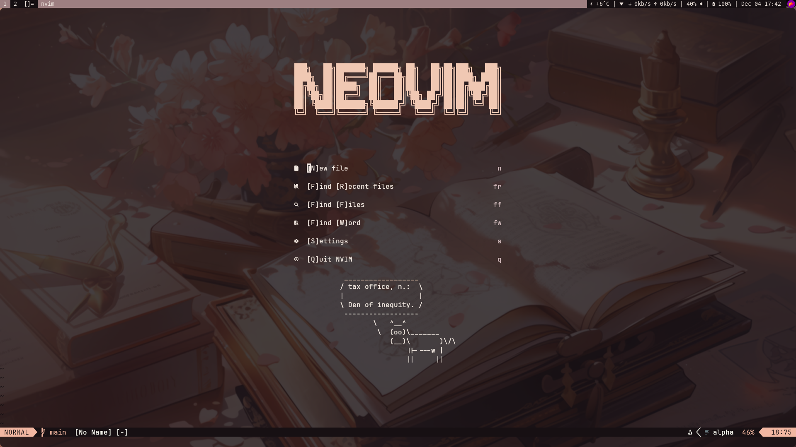

# Neovim Configuration

This repository contains my current Neovim configuration.
I used the [kickstart.nvim](https://github.com/nvim-lua/kickstart.nvim) project to tailor my configuration to my liking, and I recommend you do the same because it really helps in understanding how configurations work.
